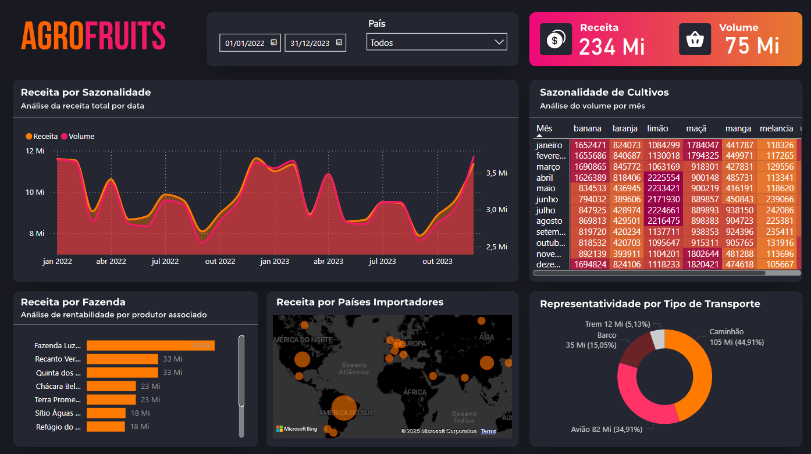

# 📊 Dashboard AgroFruits 🌱🚜  

## 📌 Sobre o Projeto  
O **Dashboard AgroFruits** foi desenvolvido para fornecer uma visão abrangente das receitas e volumes de produção da empresa, destacando a **sazonalidade das culturas, o desempenho das fazendas, a representatividade dos países importadores e os tipos de transporte utilizados**.  

🔹 **Objetivo:** Monitorar o desempenho financeiro e operacional, identificar tendências sazonais e otimizar a logística de transporte.  

## 🎯 Objetivos de Análise  

✅ **Sazonalidade:** Planejamento estratégico de cultivo e vendas nos períodos de maior demanda.  
✅ **Otimização de Transporte:** Análise da representatividade de cada tipo de transporte e alocação eficiente de recursos.  
✅ **Desempenho de Fazendas:** Identificação de oportunidades de melhoria e boas práticas das fazendas mais rentáveis.  
✅ **Expansão de Mercado:** Avaliação dos países importadores mais lucrativos e exploração de mercados subexplorados.  

## 📈 Indicadores-Chave de Desempenho (KPIs)  

📌 **Receita Total** – Monitoramento do total de receita gerada.  
📌 **Volume de Produção** – Acompanhamento do volume total produzido.  
📌 **Receita por Fazenda** – Identificação da performance individual de cada fazenda.  
📌 **Receita por País Importador** – Avaliação da contribuição de cada país importador.  
📌 **Volume por Mês** – Análise da sazonalidade e dos volumes de produção mensais.  
📌 **Representatividade por Tipo de Transporte** – Distribuição da receita entre diferentes modais (barco, caminhão, avião).  
